<div align="center">

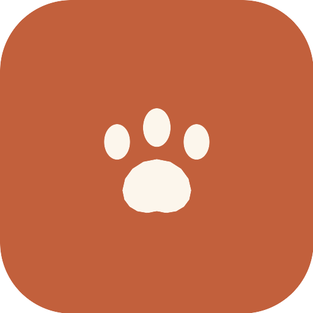

# 🐾 Canidor

### Tout pour votre chien, au même endroit.

**Canidor** est une application mobile **PWA** qui réunit l'identification, la santé,
le comportement, l'éducation et l'alimentation du chien — un compagnon intelligent
pour mieux comprendre **Stanley** 🦴 (Cocker Spaniel Anglais, mâle, 4 ans, 17 kg).

[](https://web.dev/progressive-web-apps/)
[](https://react.dev)
[](https://vite.dev)
[](https://www.netlify.com/)


</div>

---

## ✨ Aperçu

| Accueil | Fonctions | Carnet de santé |
|:---:|:---:|:---:|
| 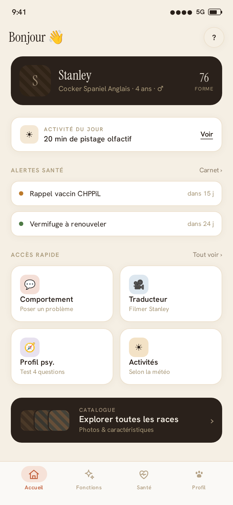 | 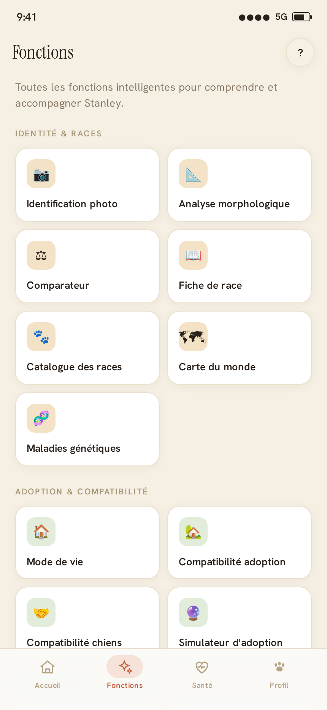 | 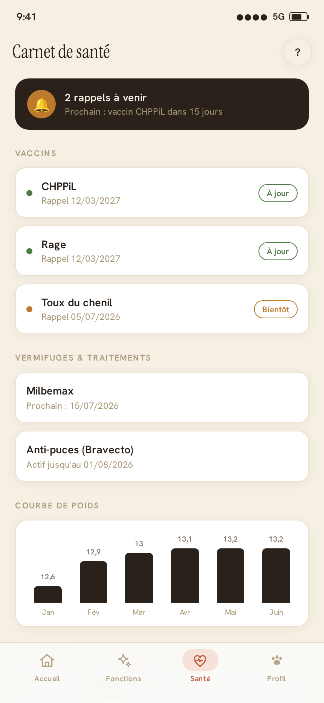 |
| **Profil** | **Fiche de race** | **Profil psychologique** |
| 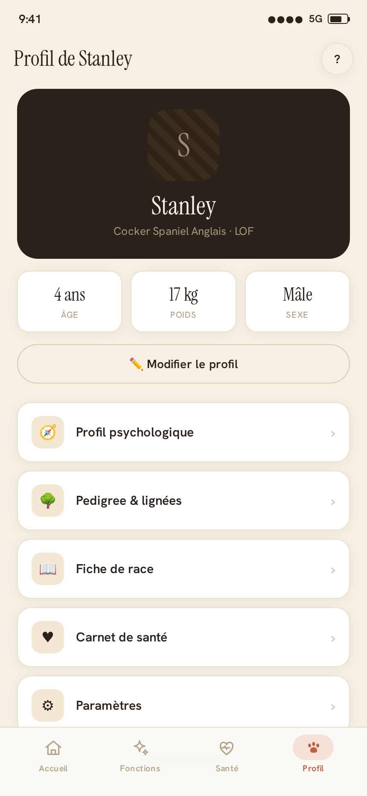 | 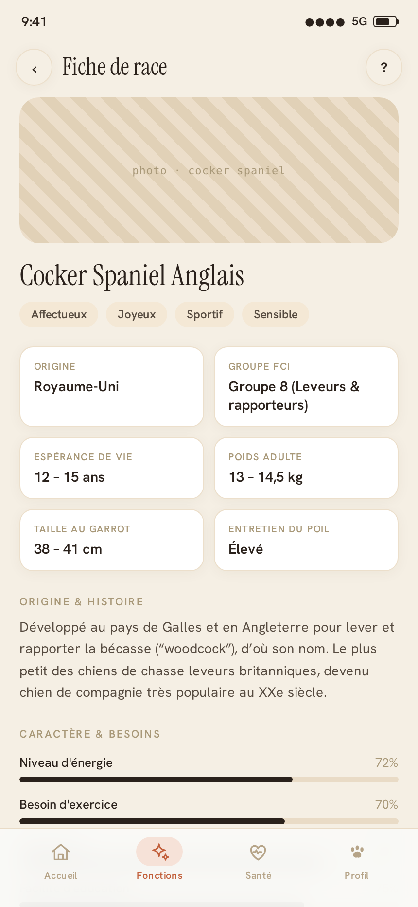 | 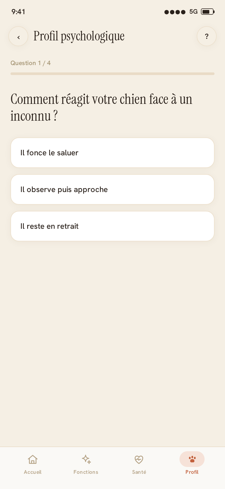 |
| **Identification photo** | **Assistant comportement** | **Jumeau numérique** |
| 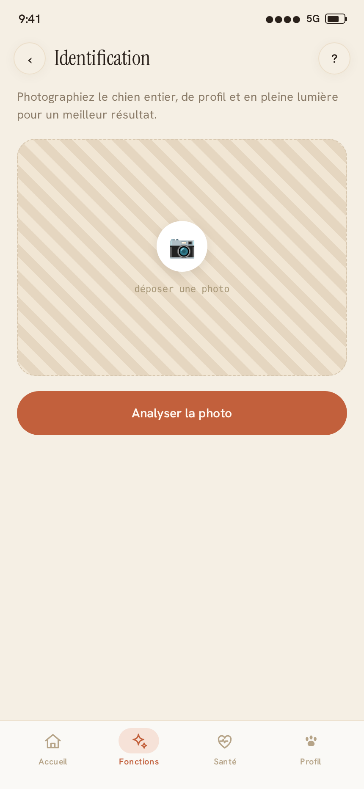 | 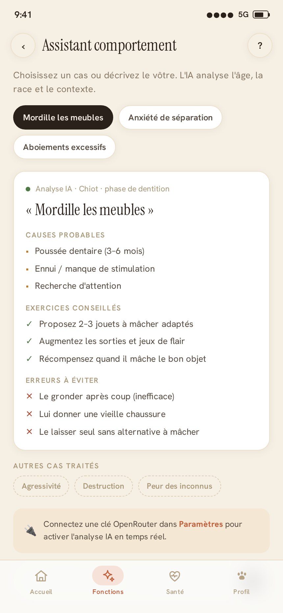 | 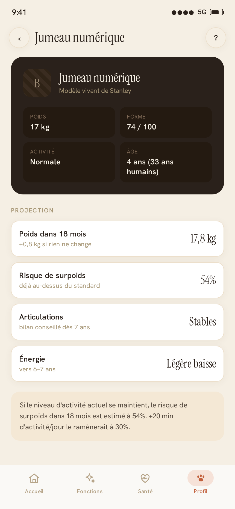 |
| **Paramètres · OpenRouter** | **Catalogue des races** | **Onboarding** |
| 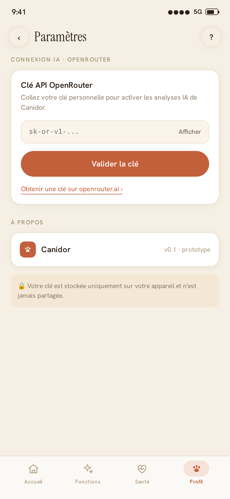 | 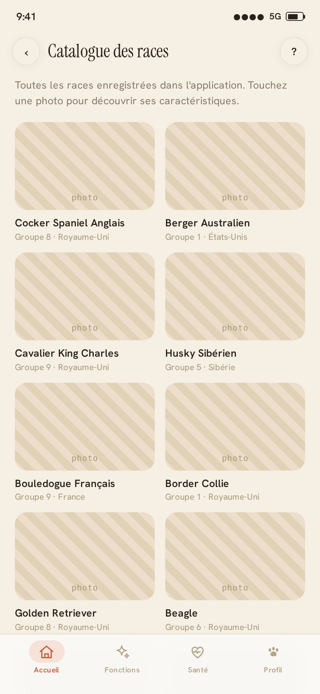 | 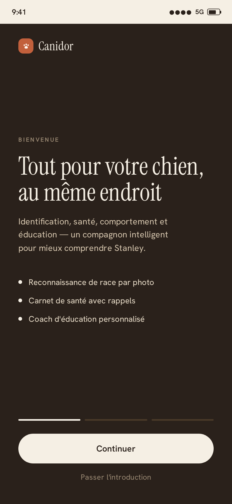 |

---

## 🧭 Fonctionnalités

Plus de **35 fonctions** regroupées en **7 sections** :

- 🐶 **Identité & races** — identification photo, analyse morphologique, comparateur, fiche de race, catalogue, carte du monde, maladies génétiques
- 🏡 **Adoption & compatibilité** — mode de vie, compatibilité adoption, compatibilité entre chiens, simulateur d'adoption
- 💬 **Comportement & langage** — assistant comportement, profil psychologique, traducteur vidéo, langage corporel, « pourquoi mon chien ? », reconnaissance & anti-aboiement
- ❤️ **Santé & prévention** — carnet de santé, analyse santé photo, poids & forme, âge humain, détection de douleur, analyse prédictive, pré-consultation véto
- 🍖 **Alimentation** — assistant alimentation, recettes maison
- 🎓 **Activité & éducation** — coach d'éducation, activités du jour, programmes météo, parcours de promenade, exercices mentaux, niveau d'activité
- ✨ **Suivi & avancé** — chronologie de vie, jumeau numérique, pedigree & lignées

Le tout factorisé via **7 archétypes** réutilisables :
`Rapport` · `Capture IA` · `Explainer` · `Questionnaire` · `Générateur` · `Calcul/Info` · `Liste/détail`.

Et aussi : 📲 **onboarding** rejouable · ❓ **aide contextuelle** par écran ·
🔔 rappels santé · ✏️ **profil éditable** · 🌙 thème crème/espresso/terracotta.

---

## 🚀 Démarrer

```bash
npm install
npm run dev        # serveur de développement (http://localhost:5173)
npm run build      # build de production -> dist/
npm run preview    # prévisualiser le build
```

> Pré-requis : **Node 20+**.

---

## 🤖 Intelligence artificielle (OpenRouter)

Canidor branche les analyses IA sur votre **propre clé OpenRouter**. Rendez-vous
dans **Profil → Paramètres** :

1. 🔑 Collez votre clé `sk-or-…` (bouton **Afficher / Masquer**).
2. ✅ **Validation réelle** via `GET https://openrouter.ai/api/v1/auth/key`
   (`Authorization: Bearer`) — `200` validée, non-OK refusée (code), erreur
   réseau/CORS → repli (clé enregistrée avec avertissement).
3. 🆓 **Modèle gratuit** chargé dynamiquement depuis `GET /api/v1/models`
   filtré `pricing.prompt === "0"` (repli sur une liste `:free` curée).
4. 💾 Persistance locale (`localStorage` : `canidor_or_key`, `canidor_or_model`),
   rechargée au démarrage.

Une fois clé + modèle configurés, les écrans **Capture IA / Rapport / Explainer**
appellent `POST /api/v1/chat/completions` et affichent la réponse. Sans clé, ils
conservent la démo et invitent à « connecter une clé dans Paramètres ».

> 💡 **Beaucoup d'écrans fonctionnent sans IA** : estimations locales (mode de
> vie, compatibilités, simulateur, profil psychologique, morphologie…), cas de
> comportement détaillés, catalogue de questions… L'IA **enrichit** mais n'est
> pas requise.

### 👁️ Analyse d'images & vidéo (OpenAI / Anthropic / Google)

Les modèles gratuits d'OpenRouter ne savent pas analyser d'images. Une **seconde
section** dans Paramètres permet d'ajouter une clé **OpenAI**, **Anthropic** ou
**Google** et de choisir un **modèle multimodal** (liste récupérée en direct).

- Les écrans **photo** (identification, santé, douleur, langage corporel)
  envoient alors la **vraie image** au modèle vision choisi.
- Le **Traducteur canin** accepte une photo **ou une courte vidéo** : l'app en
  **extrait quelques images** côté navigateur et les analyse (les API de chat
  n'ingèrent pas de flux vidéo).

> 🔒 **Confidentialité** — vos clés (OpenRouter et vision) restent **sur
> l'appareil** et ne transitent que dans l'en-tête d'autorisation des appels
> directs au fournisseur. La géolocalisation ne sert qu'à la météo des activités.
>
> ⚠️ **Avertissement** — toutes les analyses IA sont **indicatives** et ne
> remplacent jamais l'avis d'un vétérinaire ou d'un éducateur professionnel.

---

## 📲 Installation en PWA

L'application est **installable** (manifeste + service worker + icônes).

- **iOS / Safari** : Partager → « Sur l'écran d'accueil ».
- **Android / Chrome** : menu ⋮ → « Installer l'application ».

L'icône  (patte
terracotta) identifie l'app sur l'écran d'accueil.

---

## ☁️ Déploiement Netlify

`netlify.toml` est fourni (build `npm run build`, publication `dist`, fallback SPA).

```bash
npm run build && netlify deploy --prod --dir=dist
```

Ou connectez simplement le dépôt GitHub à Netlify — la configuration est détectée
automatiquement.

---

## 🗂️ Architecture

```
src/
├─ theme.js              # design tokens (couleurs, polices, placeholders rayés)
├─ store/
│  ├─ AppContext.jsx     # profil chien + OpenRouter + fournisseur vision + runAnalysis
│  ├─ BreedsContext.jsx  # catalogue de races (base + ajouts/overrides persistés)
│  ├─ ActivityContext.jsx# activités du jour, météo réelle, historique
│  └─ ChromeContext.jsx  # surcharge titre/retour + goScreen (liste/détail)
├─ data/                 # jeux de données (races, santé, questions, modèles, aide…)
├─ lib/
│  ├─ openrouter.js      # OpenRouter : validation clé, modèles, chat completions
│  ├─ visionProviders.js # OpenAI/Anthropic/Google : modèles + analyse multi-images
│  ├─ videoFrames.js     # extraction de frames d'une vidéo (canvas)
│  ├─ prompts.js         # prompts par écran
│  └─ …                  # estimations locales (lifestyle, dogcompat, simulator,
│                        #   psyProfile, bodylang, morpho, breedFilters…) + caches
├─ hooks/useAnalysis.js  # machine Capture IA + génération texte (via runAnalysis)
├─ components/           # StatusBar, AppBar, TabBar, Onboarding, HelpSheet, UI, CaptureScreen
└─ screens/              # ~35 écrans groupés par section + registre (index.js)
```

Plus de détails dans **[CONTEXT.md](CONTEXT.md)**. Historique des versions dans
**[CHANGELOG.md](CHANGELOG.md)**.

---

## 🎨 Design system

| Rôle | Couleur |
|---|---|
| Fond crème | `#F5EFE4` |
| Encre / espresso | `#2A211B` |
| Accent terracotta | `#C2603C` |
| Succès / Avertissement / Danger | `#4E7A45` / `#BC7A2C` / `#B0543E` |

Typographie : **Instrument Serif** (titres & grands nombres) + **Hanken Grotesk** (UI).

---

<div align="center">
<sub>Recréé fidèlement à partir du prototype <code>design_handoff_canidor/</code>. 🐾</sub>
</div>
